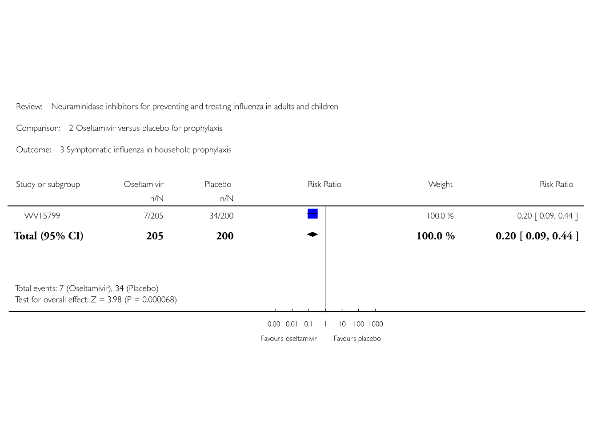
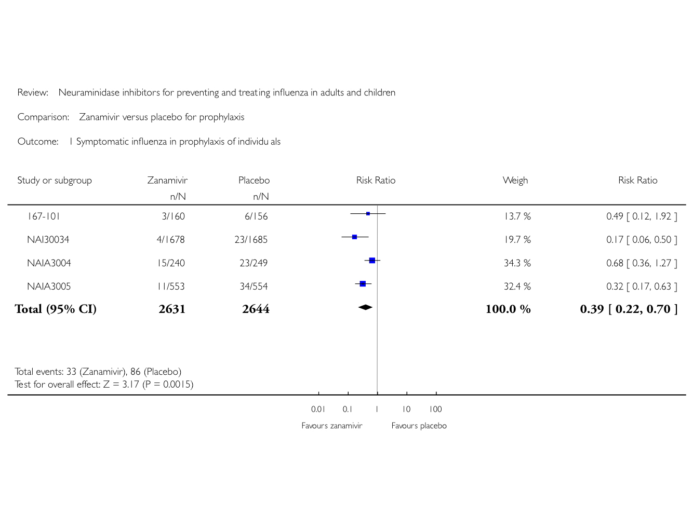
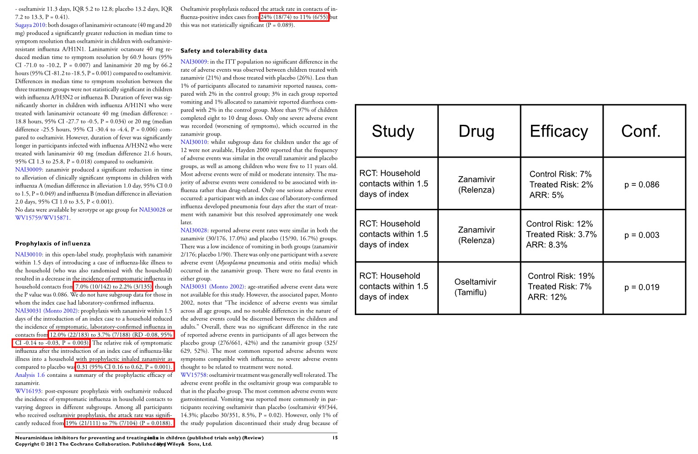

## Road Map 

- Brief case presentation

- PICO Question

- Background on testing

- Starting to answer

- Putting everything together

# Initial presentation

## Presented to OSH
- Patient was a 2 m/o male, born at 29 weeks without a diagnosis of CLD. He presented with chest and nasal congestion x 24h. He had no fever, no vomiting, no SOB. Family had not seen retractions. 

- Had sick contacts: sister with cough and congestion with rhinorrhea. He did not attend daycare.

- Vaccines were up to date.

- Parents were concerned due to his prematurity, so requested transfer to the UMC ER for evaluation by Pediatrics. 

## At UMC ED

- No need for transfer via EMS.

- PO intake had been slightly decreased. Still had 8 wet diapers in preceding 24h.

- Pt was tired, but not lethargic or toxic. In OSH ER, **Flu** and **RSV** negative. In ER, appeared comfortable on RA w/o retractions. Of note, a single loose tooth was present.

## Assesment

- Most likely etiology is viral URI. PO intake is adequate and patient is well hydrated.

## Plan
- OK to DC home
- Tylenol PRN fever/pain
- Nasal saline and bulb suctioning as needed
- Discussed return precautions
- Establish with dentist for tooth extraction

## Second presentation

## Prior to UMC arrival

- Presented to OSH after an apneic episode. Parents had taken him to Brownfield to a dentist at noon for removal of the neonatal tooth. He was given lidocaine there prior to removal. No complications at the office and the family returned home. 

## On arrival to UMC

- He was acting well on room air with short pauses in breathing that appeared to be periodic breathing. At approximately 1900 he became apneic and had desaturations to the 20s, followed by bradycardia to the 40s. 

- Code blue was called: 
    - He was bagged and chest compressions were done. Chest compressions required twice and atropine given once during the code. 
    - He remained with a pulse during the episode. He was intubated by anesthesia and placed on the ventilator with good saturations. 

## Labs and current situation

- An RVP showed
    - Flu A+ (no subtype positive)
    - RSV B+

- Subsequently started on tamiflu

- He has now been in the PICU for about two weeks and is still not doing well

# First, how bad is this flu season?

## Not too bad actually

```{r, , message=FALSE, warning=FALSE, echo=FALSE, out.height = "575px"}
knitr::include_graphics("files/PedFluDeath_WeeklyImage.jpeg")
```

# PICO Question

## 

In children, how effective are the flu vaccine and neuraminidase inhibitors (NI) compared to placebo at **preventing** medically attended flu infections?

# There are several preliminaries.

## Briefly, how well do rapid diagnostics work?

## Lots of studies on RIDTs

```{r, , message=FALSE, warning=FALSE, echo=FALSE, out.height = "575px"}
knitr::include_graphics("files/ridt_demo.png")
```

## RIDTs perform better in children

```{r, , message=FALSE, warning=FALSE, echo=FALSE, out.height = "575px"}
knitr::include_graphics("files/ridt_subgroups.png")
```

## Timing matters for RIDTs 

```{r, , message=FALSE, warning=FALSE, echo=FALSE, out.height = "575px"}
knitr::include_graphics("files/ridt_timing.png")
```

## Real effectiveness depends on prevalence 

## Our region is around 10% now 

```{r, , message=FALSE, warning=FALSE, echo=FALSE, out.height = "575px"}
knitr::include_graphics("files/prevalence.jpeg")
```

# How effective is the flu vaccine? 

## It varies widely each year 

```{r, , message=FALSE, warning=FALSE, echo=FALSE, out.height = "575px"}
knitr::include_graphics("files/vaccine-effectiveness-table-2016.png")
```

## How about in children this year? 

```{r, , message=FALSE, warning=FALSE, echo=FALSE, out.height = "575px"}
knitr::include_graphics("files/bydemo.png")
```

# How effective are NIs? 

## Oseltamivir is moderately effective

```{r, , message=FALSE, warning=FALSE, echo=FALSE, out.height = "575px"}

```

## Zanamivir is moderately effective 

```{r, , message=FALSE, warning=FALSE, echo=FALSE, out.height = "575px"}

```

## Similarly so for PEP 

```{r, , message=FALSE, warning=FALSE, echo=FALSE, out.height = "575px"}
knitr::include_graphics("files/tamiflu_effectiveness_2.png")
```

## And for preventing pneumonia 

```{r, , message=FALSE, warning=FALSE, echo=FALSE, out.height = "575px"}
knitr::include_graphics("files/tamiflu_effectiveness_3.png")
```

## How about in children? 

```{r, , message=FALSE, warning=FALSE, echo=FALSE, out.height = "575px"}

```

# These studies are decent, but what does it mean? 

## Some calculations to make it simple to understand

# The End
